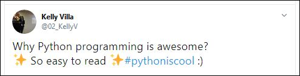

## Welcome to my Python project!

Welcome to the Python world!
-   [0x00-python-hello_world](https://github.com/02KellyV/holbertonschool-higher_level_programming/tree/master/0x00-python-hello_world):
	- Why Python programming is awesome?
	- 
	- What is Python?
	_Python_ is an interpreted, high-level, general-purpose programming language. It supports multiple programming paradigms, including procedural, object-oriented, and functional programming.
	- Who is Guido van Rossum?
	__Guido van Rossum__ is a Dutch programmer best known as the author of the Python programming language...
	- Where does the name ‘Python’ come from?
	By the way, the language is named after the BBC show _“Monty Python’s Flying Circus”_ and has nothing to do with reptiles. Making references to Monty Python skits in documentation is not only allowed, it is encouraged!
	- What is the Zen of Python?
	```
	The Zen of Python, by Tim Peters

	Beautiful is better than ugly.
	Explicit is better than implicit.
	Simple is better than complex.
	Complex is better than complicated.
	Flat is better than nested.
	Sparse is better than dense.
	Readability counts.
	Special cases aren't special enough to break the rules.
	Although practicality beats purity.
	Errors should never pass silently.
	Unless explicitly silenced.
	In the face of ambiguity, refuse the temptation to guess.
	There should be one-- and preferably only one --obvious way to do it.
	Although that way may not be obvious at first unless you're Dutch.
	Now is better than never.
	Although never is often better than *right* now.
	If the implementation is hard to explain, it's a bad idea.
	If the implementation is easy to explain, it may be a good idea.
	Namespaces are one honking great idea -- let's do more of those!

	```
- [How to use the Python interpreter?](https://docs.python.org/3.4/tutorial/interpreter.html)

- What is the official __Holberton Python coding style__ and how to check your code?
		- `Pycodestyle` is now the [new standard of Python style code](https://intranet.hbtn.io/rltoken/D67mmHg2X9ZI7QHlQxayyw "new standard of Python style code"), but at school we will use `PEP8`, `version 1.7.*`. Don’t worry, `pycodestyle` is based on `pep8`. 
		- The hardest part now is to install it for Python 3: 
			-  Regular Ubuntu 14.04 install: 
			 `$ sudo apt-get install python3-pep8`
			 - Using Pip3. Install 
			 `$ sudo apt-get install python3-pip`
		- `Pep8` Install: 
		`$ pip3 install pep8`  
		- Make sure you have the right version: 
		`$ pep8 --version`
		`$ 1.7`

If it’s not the case, it means PEP8 is installed but not linked in your `PATH`. You should look at these folders to find where it has been installed:

-   `/usr/local/lib/python3*/dist-packages/pep8.py`
-   `/usr/lib/python3*/dist-packages/pep8.py`

Don’t hesitate to delete `/usr/bin/pep8` and replace by one of those `pep8.py`:

-   `cp pep8.py /usr/bin/pep8`
-   `chmod u+x /usr/bin/pep8`

Finally, if you can’t make it work, please use the “container-on-demand” tool to “PEP8” your files in a pre-configured container.

## Python 'is' vs '==' ...
